# Архитектура соцсети в динамике — C4, ER, Sequence

Документ с диаграммами Mermaid: модель системы (C4), схемы данных (ER),
жизненные циклы сущностей (state), и пошаговые сценарии (sequence).
Все блоки рендерятся в любом просмотрщике с поддержкой Mermaid.

## Оглавление

1. [C4 — модель системы](#1-c4--модель-системы)
2. [Карта данных по хранилищам](#2-карта-данных-по-хранилищам)
3. [ER-диаграммы](#3-er-диаграммы)
4. [Жизненные циклы (state)](#4-жизненные-циклы-сущностей)
5. [Сценарии в динамике (sequence)](#5-сценарии-в-динамике)
6. [Сквозные механизмы](#6-сквозные-механизмы)

---

# 1. C4 — модель системы

**C4** — способ описывать архитектуру на четырёх уровнях масштаба:
**C**ontext (система и её окружение) → **C**ontainer (приложения и хранилища)
→ **C**omponent (модули внутри контейнера) → **C**ode (классы). Идём сверху вниз.

## 1.1. Уровень 1 — System Context

Кто пользуется системой и с какими внешними системами она взаимодействует.

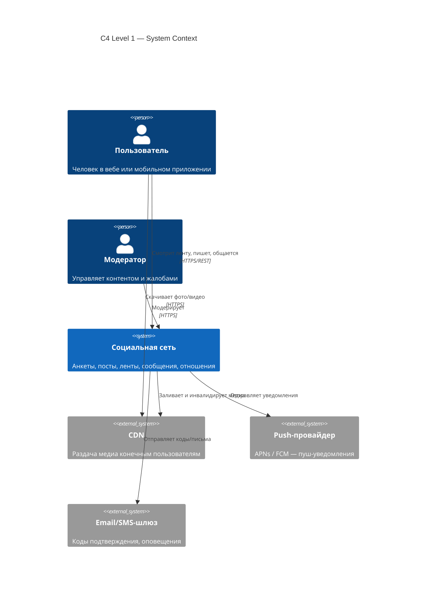
```mermaid
C4Context
    title C4 Level 1 — System Context

    Person(user, "Пользователь", "Человек в вебе или мобильном приложении")
    Person(admin, "Модератор", "Управляет контентом и жалобами")

    System(social, "Социальная сеть", "Анкеты, посты, ленты, сообщения, отношения")

    System_Ext(cdn, "CDN", "Раздача медиа конечным пользователям")
    System_Ext(push, "Push-провайдер", "APNs / FCM — пуш-уведомления")
    System_Ext(email, "Email/SMS-шлюз", "Коды подтверждения, оповещения")

    Rel(user, social, "Смотрит ленту, пишет, общается", "HTTPS/REST")
    Rel(admin, social, "Модерирует", "HTTPS")
    Rel(social, cdn, "Заливает и инвалидирует медиа")
    Rel(user, cdn, "Скачивает фото/видео", "HTTPS")
    Rel(social, push, "Отправляет уведомления")
    Rel(social, email, "Отправляет коды/письма")

    UpdateLayoutConfig($c4ShapeInRow="3", $c4BoundaryInRow="1")
```

## 1.2. Уровень 2 — Containers

Из чего система состоит: сервисы и хранилища, обсуждённые ранее.

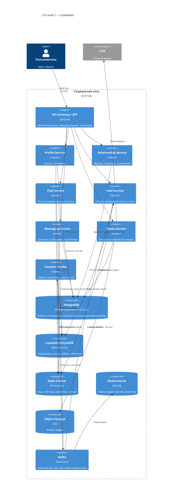
```mermaid
C4Container
    title C4 Level 2 — Containers

    Person(user, "Пользователь", "Web / Mobile")

    System_Boundary(sn, "Социальная сеть") {
        Container(gw, "API Gateway / BFF", "Go/Java", "Аутентификация, маршрутизация, агрегация")

        Container(profileSvc, "Profile Service", "сервис", "Анкеты, интересы")
        Container(relSvc, "Relationship Service", "сервис", "Друзья, подписки, отношения")
        Container(postSvc, "Post Service", "сервис", "Посты, комментарии, хэштеги")
        Container(feedSvc, "Feed Service", "сервис", "Сборка домашней ленты и стен")
        Container(msgSvc, "Messaging Service", "сервис", "Диалоги, сообщения, прочтение")
        Container(mediaSvc, "Media Service", "сервис", "Загрузка и обработка медиа")
        Container(counterSvc, "Counter Service", "сервис", "Лайки, просмотры, async-flush")

        ContainerDb(pg, "PostgreSQL", "RDBMS (шардинг по user_id)", "Анкеты, отношения, контент постов, медиа-метаданные")
        ContainerDb(cass, "Cassandra/ScyllaDB", "Wide-column", "Сообщения, ленты, лайки, счётчики")
        ContainerDb(redis, "Redis Cluster", "In-memory", "Кэш, счётчики, presence, unread")
        ContainerDb(es, "Elasticsearch", "Search", "Поиск людей, постов, хэштегов")
        ContainerDb(s3, "Object Storage", "S3", "Блобы медиа")
        Container(kafka, "Kafka", "Event bus", "События fan-out, счётчиков, индексации")
    }

    System_Ext(cdn, "CDN", "Раздача медиа")

    Rel(user, gw, "REST API", "HTTPS")
    Rel(gw, profileSvc, "")
    Rel(gw, relSvc, "")
    Rel(gw, postSvc, "")
    Rel(gw, feedSvc, "")
    Rel(gw, msgSvc, "")
    Rel(gw, mediaSvc, "")

    Rel(profileSvc, pg, "CRUD анкет")
    Rel(profileSvc, redis, "Кэш анкет")
    Rel(relSvc, pg, "Друзья/подписки/отношения")
    Rel(postSvc, pg, "Контент постов")
    Rel(postSvc, kafka, "Событие post.created")
    Rel(feedSvc, cass, "Чтение/запись лент")
    Rel(feedSvc, redis, "Кэш головы ленты")
    Rel(msgSvc, cass, "Сообщения, inbox, read-state")
    Rel(msgSvc, redis, "unread, presence")
    Rel(mediaSvc, s3, "Заливка блобов")
    Rel(mediaSvc, pg, "Метаданные медиа")
    Rel(mediaSvc, cdn, "Инвалидация")
    Rel(counterSvc, redis, "INCR счётчиков")
    Rel(counterSvc, cass, "Flush в counters")
    Rel(kafka, feedSvc, "post.created → fan-out")
    Rel(kafka, es, "Индексация")
    Rel(kafka, counterSvc, "События счётчиков")

    UpdateLayoutConfig($c4ShapeInRow="3", $c4BoundaryInRow="1")
```

## 1.3. Уровень 3 — Component: Feed Service

Что внутри сервиса ленты — модули и их связи.

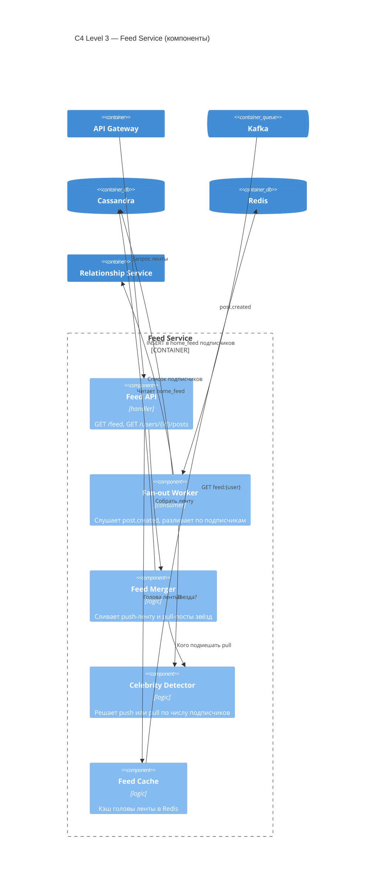
```mermaid
C4Component
    title C4 Level 3 — Feed Service (компоненты)

    Container(gw, "API Gateway", "")
    ContainerQueue(kafka, "Kafka", "")
    ContainerDb(cass, "Cassandra", "")
    ContainerDb(redis, "Redis", "")
    Container(relSvc, "Relationship Service", "")

    Container_Boundary(feed, "Feed Service") {
        Component(api, "Feed API", "handler", "GET /feed, GET /users/{id}/posts")
        Component(fanout, "Fan-out Worker", "consumer", "Слушает post.created, разливает по подписчикам")
        Component(merger, "Feed Merger", "logic", "Сливает push-ленту и pull-посты звёзд")
        Component(celeb, "Celebrity Detector", "logic", "Решает push или pull по числу подписчиков")
        Component(cache, "Feed Cache", "logic", "Кэш головы ленты в Redis")
    }

    Rel(gw, api, "Запрос ленты")
    Rel(api, cache, "Голова ленты?")
    Rel(cache, redis, "GET feed:{user}")
    Rel(api, merger, "Собрать ленту")
    Rel(merger, cass, "Читает home_feed")
    Rel(merger, celeb, "Кого подмешать pull")
    Rel(kafka, fanout, "post.created")
    Rel(fanout, celeb, "Звезда?")
    Rel(fanout, relSvc, "Список подписчиков")
    Rel(fanout, cass, "INSERT в home_feed подписчиков")

    UpdateLayoutConfig($c4ShapeInRow="2", $c4BoundaryInRow="1")
```

## 1.4. Уровень 3 — Component: Messaging Service

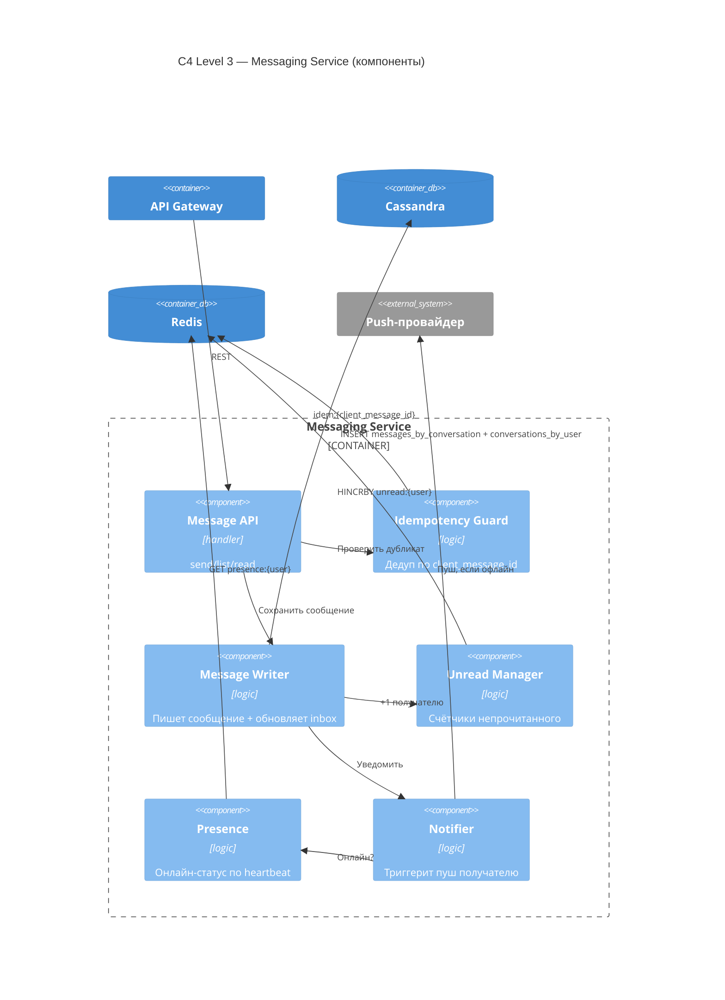
```mermaid
C4Component
    title C4 Level 3 — Messaging Service (компоненты)

    Container(gw, "API Gateway", "")
    ContainerDb(cass, "Cassandra", "")
    ContainerDb(redis, "Redis", "")
    System_Ext(push, "Push-провайдер", "")

    Container_Boundary(msg, "Messaging Service") {
        Component(api, "Message API", "handler", "send/list/read")
        Component(idem, "Idempotency Guard", "logic", "Дедуп по client_message_id")
        Component(writer, "Message Writer", "logic", "Пишет сообщение + обновляет inbox")
        Component(unread, "Unread Manager", "logic", "Счётчики непрочитанного")
        Component(presence, "Presence", "logic", "Онлайн-статус по heartbeat")
        Component(notifier, "Notifier", "logic", "Триггерит пуш получателю")
    }

    Rel(gw, api, "REST")
    Rel(api, idem, "Проверить дубликат")
    Rel(idem, redis, "idem:{client_message_id}")
    Rel(api, writer, "Сохранить сообщение")
    Rel(writer, cass, "INSERT messages_by_conversation + conversations_by_user")
    Rel(writer, unread, "+1 получателю")
    Rel(unread, redis, "HINCRBY unread:{user}")
    Rel(writer, notifier, "Уведомить")
    Rel(notifier, presence, "Онлайн?")
    Rel(presence, redis, "GET presence:{user}")
    Rel(notifier, push, "Пуш, если офлайн")

    UpdateLayoutConfig($c4ShapeInRow="2", $c4BoundaryInRow="1")
```

---

# 2. Карта данных по хранилищам

Куда какой домен пишется/читается (обзорная схема потоков).

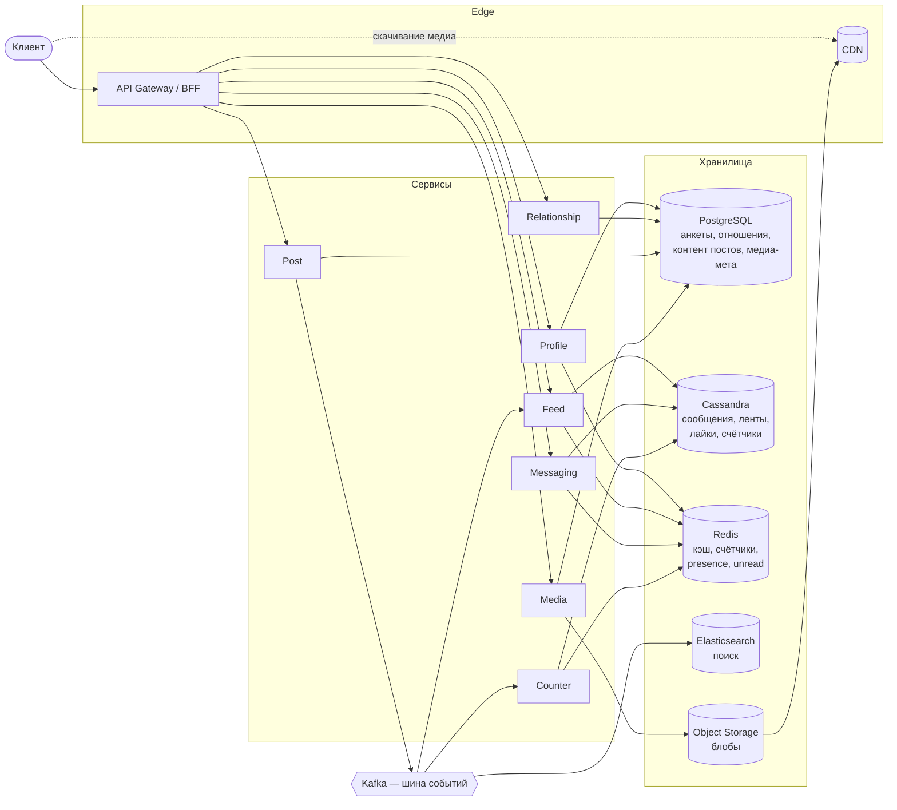
```mermaid
flowchart LR
    client([Клиент])

    subgraph edge[Edge]
        gw[API Gateway / BFF]
        cdn[(CDN)]
    end

    subgraph services[Сервисы]
        profileSvc[Profile]
        relSvc[Relationship]
        postSvc[Post]
        feedSvc[Feed]
        msgSvc[Messaging]
        mediaSvc[Media]
        counterSvc[Counter]
    end

    subgraph stores[Хранилища]
        pg[(PostgreSQL<br/>анкеты, отношения,<br/>контент постов, медиа-мета)]
        cass[(Cassandra<br/>сообщения, ленты,<br/>лайки, счётчики)]
        redis[(Redis<br/>кэш, счётчики,<br/>presence, unread)]
        es[(Elasticsearch<br/>поиск)]
        s3[(Object Storage<br/>блобы)]
    end

    kafka{{Kafka — шина событий}}

    client --> gw
    client -. скачивание медиа .-> cdn

    gw --> profileSvc & relSvc & postSvc & feedSvc & msgSvc & mediaSvc

    profileSvc --> pg
    profileSvc --> redis
    relSvc --> pg
    postSvc --> pg
    postSvc --> kafka
    feedSvc --> cass
    feedSvc --> redis
    msgSvc --> cass
    msgSvc --> redis
    mediaSvc --> s3
    mediaSvc --> pg
    counterSvc --> redis
    counterSvc --> cass

    kafka --> feedSvc
    kafka --> es
    kafka --> counterSvc
    s3 --> cdn
```

---

# 3. ER-диаграммы

**ER (Entity-Relationship):** сущности (таблицы), их атрибуты и связи.
Обозначения мощности связи (crow's foot):
`||` ровно один, `o|` ноль-или-один, `o{` ноль-или-много, `|{` один-или-много.

## 3.1. Пользователи, анкеты, интересы

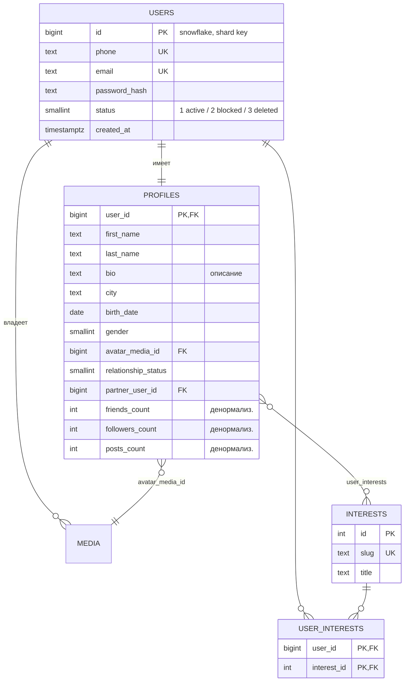
```mermaid
erDiagram
    USERS ||--|| PROFILES : "имеет"
    USERS ||--o{ MEDIA : "владеет"
    PROFILES }o--|| MEDIA : "avatar_media_id"
    PROFILES }o--o{ INTERESTS : "user_interests"
    USERS ||--o{ USER_INTERESTS : ""
    INTERESTS ||--o{ USER_INTERESTS : ""

    USERS {
        bigint id PK "snowflake, shard key"
        text phone UK
        text email UK
        text password_hash
        smallint status "1 active / 2 blocked / 3 deleted"
        timestamptz created_at
    }
    PROFILES {
        bigint user_id PK,FK
        text first_name
        text last_name
        text bio "описание"
        text city
        date birth_date
        smallint gender
        bigint avatar_media_id FK
        smallint relationship_status
        bigint partner_user_id FK
        int friends_count "денормализ."
        int followers_count "денормализ."
        int posts_count "денормализ."
    }
    INTERESTS {
        int id PK
        text slug UK
        text title
    }
    USER_INTERESTS {
        bigint user_id PK,FK
        int interest_id PK,FK
    }
```

## 3.2. Отношения: друзья, подписки, любовь

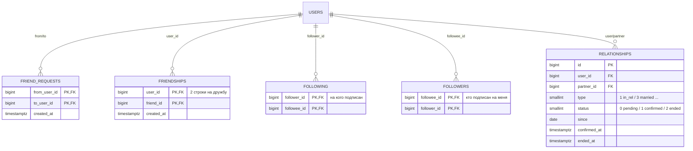
```mermaid
erDiagram
    USERS ||--o{ FRIEND_REQUESTS : "from/to"
    USERS ||--o{ FRIENDSHIPS : "user_id"
    USERS ||--o{ FOLLOWING : "follower_id"
    USERS ||--o{ FOLLOWERS : "followee_id"
    USERS ||--o{ RELATIONSHIPS : "user/partner"

    FRIEND_REQUESTS {
        bigint from_user_id PK,FK
        bigint to_user_id PK,FK
        timestamptz created_at
    }
    FRIENDSHIPS {
        bigint user_id PK,FK "2 строки на дружбу"
        bigint friend_id PK,FK
        timestamptz created_at
    }
    FOLLOWING {
        bigint follower_id PK,FK "на кого подписан"
        bigint followee_id PK,FK
    }
    FOLLOWERS {
        bigint followee_id PK,FK "кто подписан на меня"
        bigint follower_id PK,FK
    }
    RELATIONSHIPS {
        bigint id PK
        bigint user_id FK
        bigint partner_id FK
        smallint type "1 in_rel / 3 married ..."
        smallint status "0 pending / 1 confirmed / 2 ended"
        date since
        timestamptz confirmed_at
        timestamptz ended_at
    }
```

## 3.3. Посты, медиа, хэштеги, комментарии

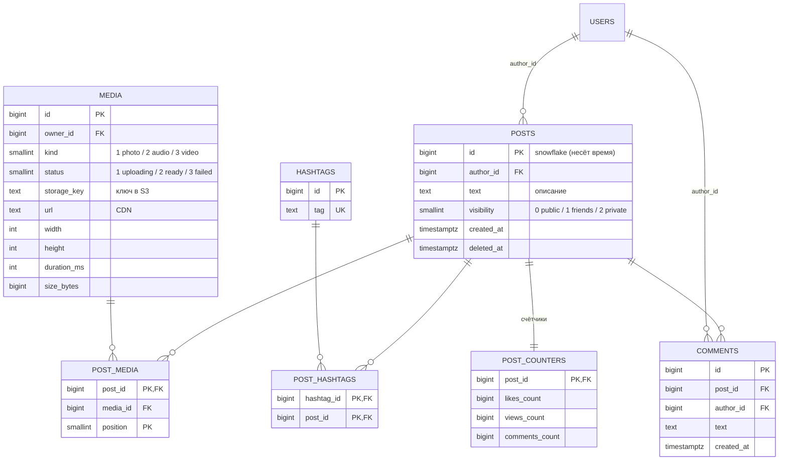
```mermaid
erDiagram
    USERS ||--o{ POSTS : "author_id"
    POSTS ||--o{ POST_MEDIA : ""
    MEDIA ||--o{ POST_MEDIA : ""
    POSTS ||--o{ POST_HASHTAGS : ""
    HASHTAGS ||--o{ POST_HASHTAGS : ""
    POSTS ||--o{ COMMENTS : ""
    POSTS ||--|| POST_COUNTERS : "счётчики"
    USERS ||--o{ COMMENTS : "author_id"

    POSTS {
        bigint id PK "snowflake (несёт время)"
        bigint author_id FK
        text text "описание"
        smallint visibility "0 public / 1 friends / 2 private"
        timestamptz created_at
        timestamptz deleted_at
    }
    MEDIA {
        bigint id PK
        bigint owner_id FK
        smallint kind "1 photo / 2 audio / 3 video"
        smallint status "1 uploading / 2 ready / 3 failed"
        text storage_key "ключ в S3"
        text url "CDN"
        int width
        int height
        int duration_ms
        bigint size_bytes
    }
    POST_MEDIA {
        bigint post_id PK,FK
        bigint media_id FK
        smallint position PK
    }
    HASHTAGS {
        bigint id PK
        text tag UK
    }
    POST_HASHTAGS {
        bigint hashtag_id PK,FK
        bigint post_id PK,FK
    }
    COMMENTS {
        bigint id PK
        bigint post_id FK
        bigint author_id FK
        text text
        timestamptz created_at
    }
    POST_COUNTERS {
        bigint post_id PK,FK
        bigint likes_count
        bigint views_count
        bigint comments_count
    }
```

## 3.4. Cassandra: модель «query-first»

В Cassandra нет JOIN и FK — таблица проектируется под конкретный запрос.
Показываю «логические» сущности и ключи (PK = partition key, CK = clustering key).

```mermaid
erDiagram
    CONVERSATIONS_BY_USER {
        bigint user_id PK "партиция = пользователь"
        timestamp last_activity_at "CK · сорт. DESC"
        bigint conversation_id "CK"
        tinyint type "1 direct / 2 group"
        text last_message_text "превью (денорм.)"
        int unread_count "счётчик"
    }
    MESSAGES_BY_CONVERSATION {
        bigint conversation_id PK "часть партиции"
        int bucket PK "yyyyMM — ограничивает партицию"
        bigint message_id "CK · snowflake, сорт. DESC"
        bigint sender_id "отправитель"
        text text "только текст"
        timestamp created_at "время"
    }
    CONVERSATION_READ_STATE {
        bigint conversation_id PK "партиция"
        bigint user_id "CK"
        bigint last_read_message_id "докуда дочитал"
    }
    HOME_FEED {
        bigint user_id PK "владелец ленты"
        bigint post_id "CK · snowflake, DESC"
        bigint author_id "автор поста"
    }
    POSTS_BY_USER {
        bigint user_id PK "стена автора"
        bigint post_id "CK · DESC"
    }
    POST_LIKES {
        bigint post_id PK "партиция"
        bigint user_id "CK"
    }
    POST_COUNTERS_C {
        bigint post_id PK
        counter likes
        counter views
        counter comments
    }
```

---

# 4. Жизненные циклы сущностей

**State diagram (диаграмма состояний):** какие состояния проходит сущность и
по каким событиям переключается.

## 4.1. Дружба

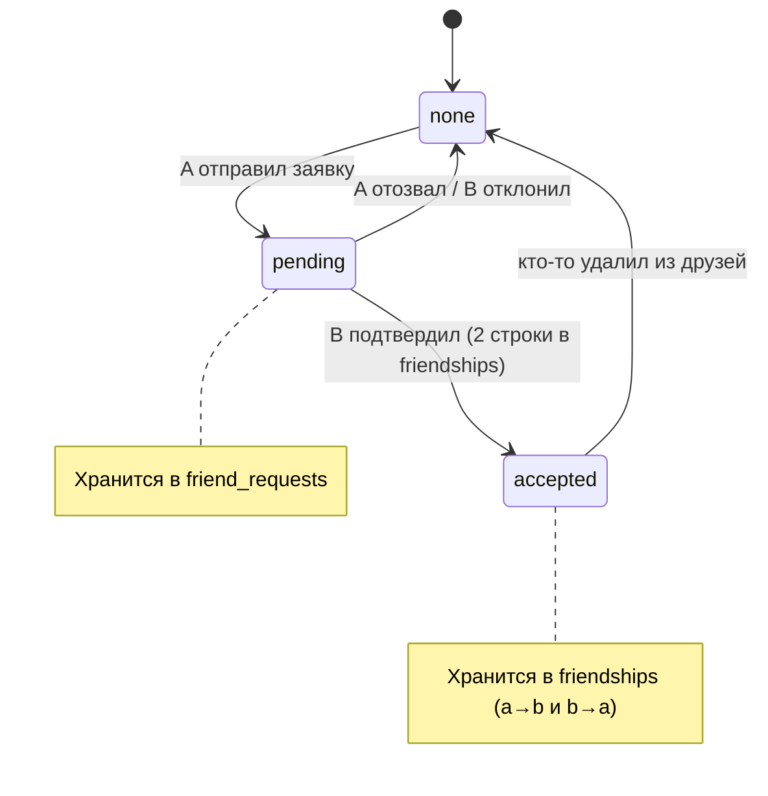
```mermaid
stateDiagram-v2
    [*] --> none
    none --> pending : A отправил заявку
    pending --> accepted : B подтвердил (2 строки в friendships)
    pending --> none : A отозвал / B отклонил
    accepted --> none : кто-то удалил из друзей
    note right of pending
        Хранится в friend_requests
    end note
    note right of accepted
        Хранится в friendships (a→b и b→a)
    end note
```

## 4.2. Любовные отношения

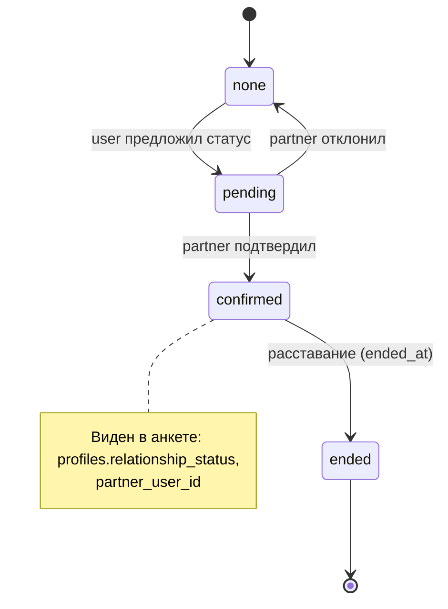
```mermaid
stateDiagram-v2
    [*] --> none
    none --> pending : user предложил статус
    pending --> confirmed : partner подтвердил
    pending --> none : partner отклонил
    confirmed --> ended : расставание (ended_at)
    ended --> [*]
    note right of confirmed
        Виден в анкете: profiles.relationship_status,
        partner_user_id
    end note
```

## 4.3. Загрузка медиа (двухфазная)

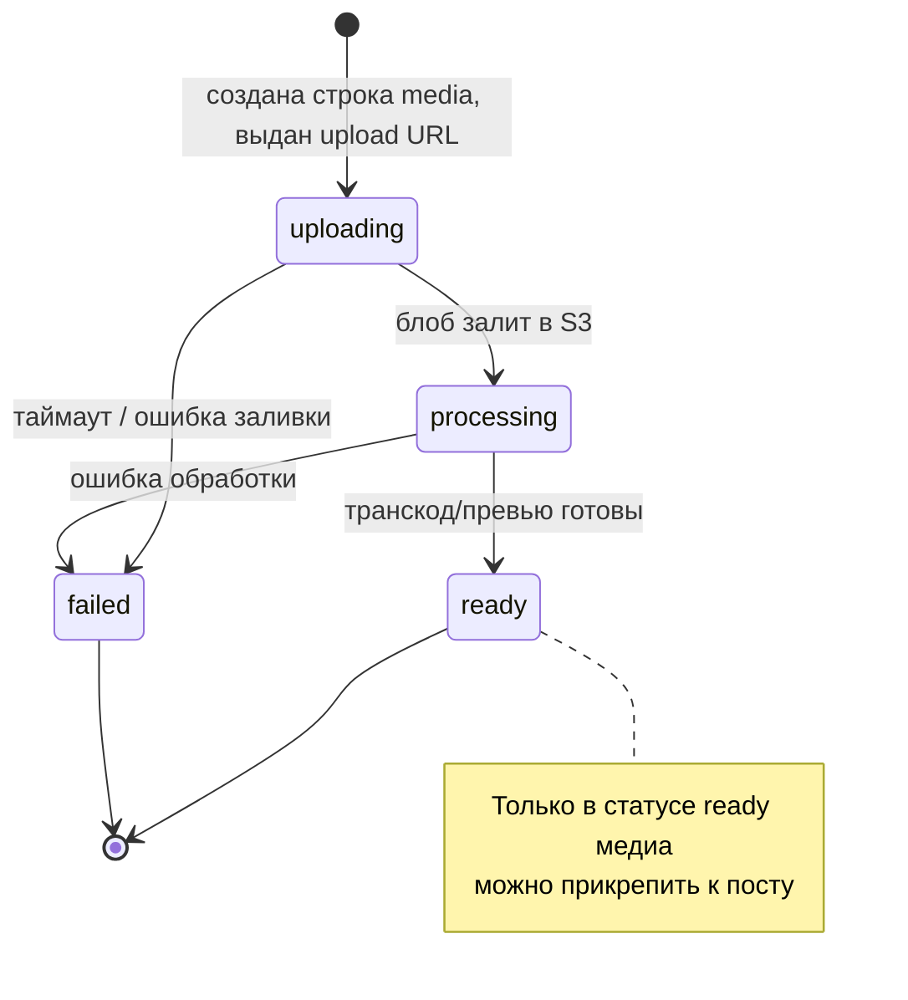
```mermaid
stateDiagram-v2
    [*] --> uploading : создана строка media, выдан upload URL
    uploading --> processing : блоб залит в S3
    processing --> ready : транскод/превью готовы
    uploading --> failed : таймаут / ошибка заливки
    processing --> failed : ошибка обработки
    ready --> [*]
    failed --> [*]
    note right of ready
        Только в статусе ready медиа
        можно прикрепить к посту
    end note
```

## 4.4. Сообщение и его прочитанность

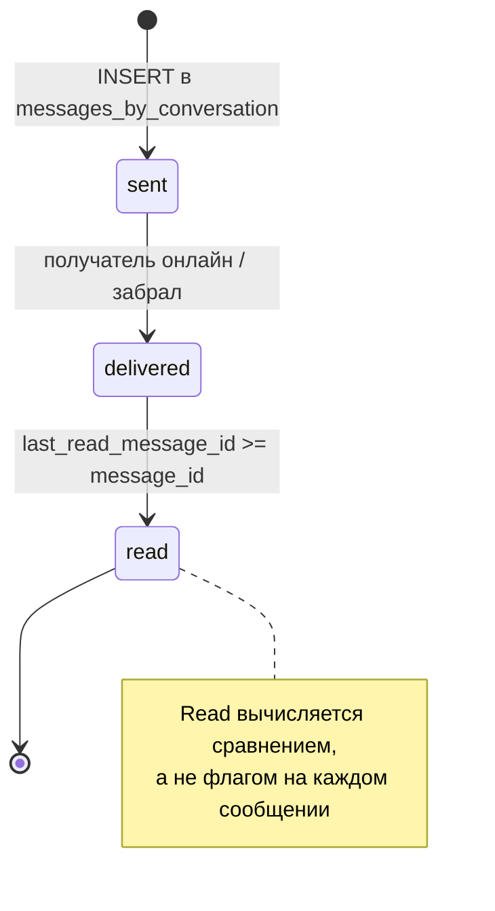
```mermaid
stateDiagram-v2
    [*] --> sent : INSERT в messages_by_conversation
    sent --> delivered : получатель онлайн / забрал
    delivered --> read : last_read_message_id >= message_id
    read --> [*]
    note right of read
        Read вычисляется сравнением,
        а не флагом на каждом сообщении
    end note
```

---

# 5. Сценарии в динамике

## 5.1. Просмотр анкеты (cache-aside + negative cache)

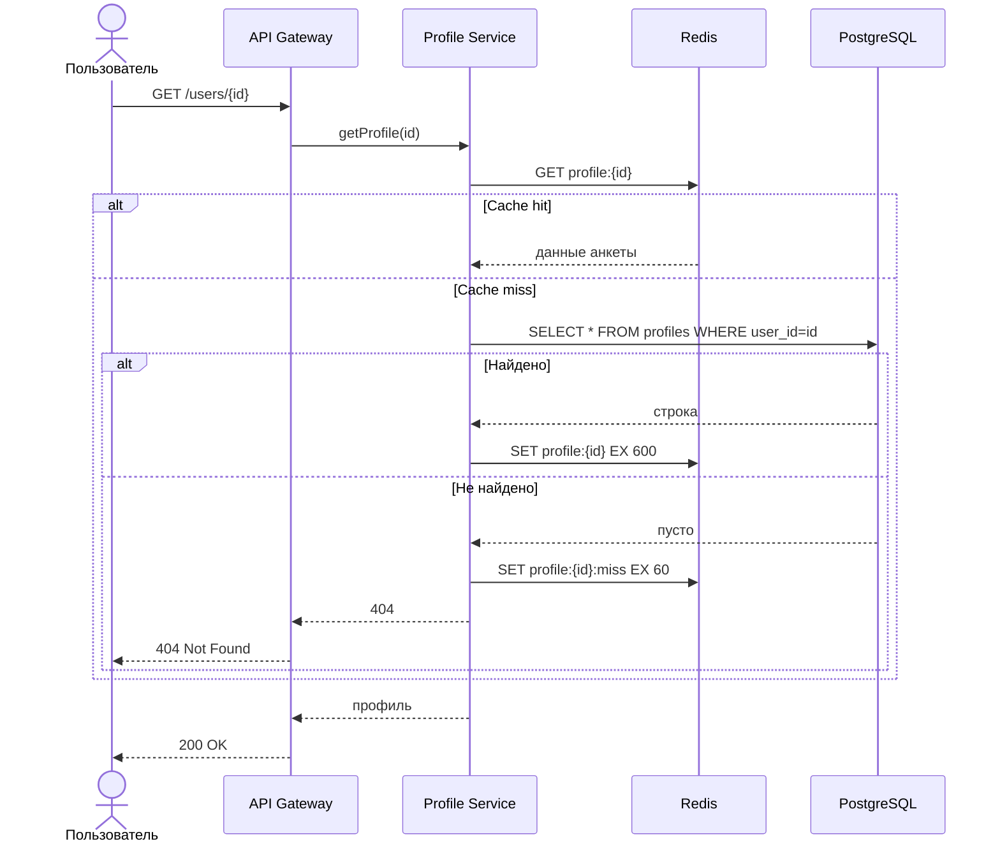
```mermaid
sequenceDiagram
    actor U as Пользователь
    participant GW as API Gateway
    participant PS as Profile Service
    participant R as Redis
    participant PG as PostgreSQL

    U->>GW: GET /users/{id}
    GW->>PS: getProfile(id)
    PS->>R: GET profile:{id}
    alt Cache hit
        R-->>PS: данные анкеты
    else Cache miss
        PS->>PG: SELECT * FROM profiles WHERE user_id=id
        alt Найдено
            PG-->>PS: строка
            PS->>R: SET profile:{id} EX 600
        else Не найдено
            PG-->>PS: пусто
            PS->>R: SET profile:{id}:miss EX 60
            PS-->>GW: 404
            GW-->>U: 404 Not Found
        end
    end
    PS-->>GW: профиль
    GW-->>U: 200 OK
```

## 5.2. Добавление в друзья

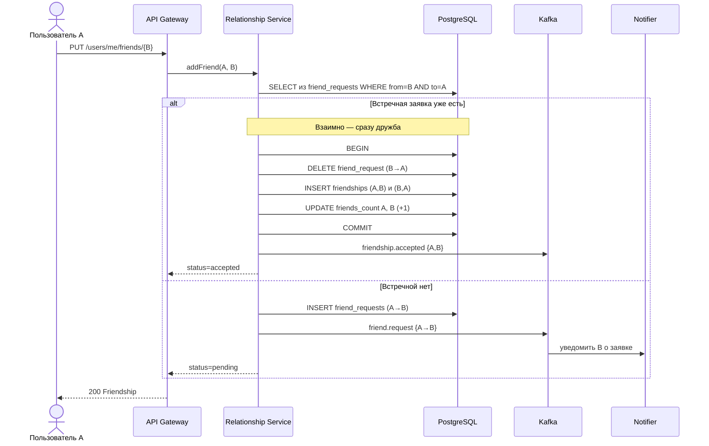
```mermaid
sequenceDiagram
    actor A as Пользователь A
    participant GW as API Gateway
    participant RS as Relationship Service
    participant PG as PostgreSQL
    participant K as Kafka
    participant N as Notifier

    A->>GW: PUT /users/me/friends/{B}
    GW->>RS: addFriend(A, B)
    RS->>PG: SELECT из friend_requests WHERE from=B AND to=A
    alt Встречная заявка уже есть
        Note over RS,PG: Взаимно — сразу дружба
        RS->>PG: BEGIN
        RS->>PG: DELETE friend_request (B→A)
        RS->>PG: INSERT friendships (A,B) и (B,A)
        RS->>PG: UPDATE friends_count A, B (+1)
        RS->>PG: COMMIT
        RS->>K: friendship.accepted {A,B}
        RS-->>GW: status=accepted
    else Встречной нет
        RS->>PG: INSERT friend_requests (A→B)
        RS->>K: friend.request {A→B}
        K->>N: уведомить B о заявке
        RS-->>GW: status=pending
    end
    GW-->>A: 200 Friendship
```

## 5.3. Удаление из друзей

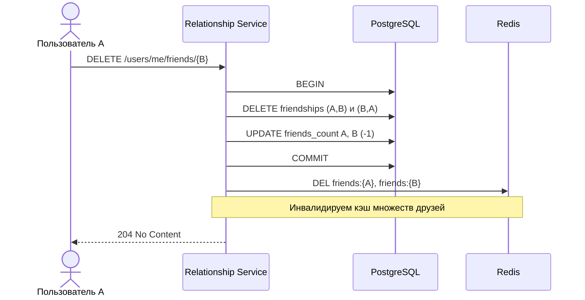
```mermaid
sequenceDiagram
    actor A as Пользователь A
    participant RS as Relationship Service
    participant PG as PostgreSQL
    participant R as Redis

    A->>RS: DELETE /users/me/friends/{B}
    RS->>PG: BEGIN
    RS->>PG: DELETE friendships (A,B) и (B,A)
    RS->>PG: UPDATE friends_count A, B (-1)
    RS->>PG: COMMIT
    RS->>R: DEL friends:{A}, friends:{B}
    Note over RS,R: Инвалидируем кэш множеств друзей
    RS-->>A: 204 No Content
```

## 5.4. Загрузка медиа (двухфазная)

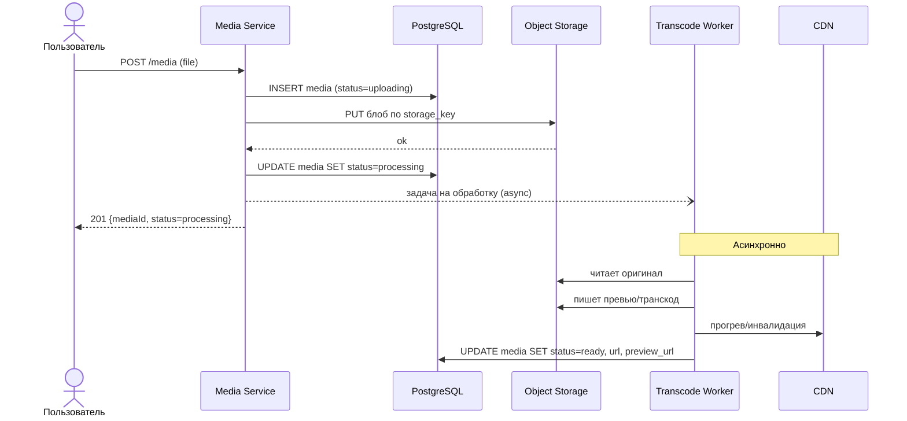
```mermaid
sequenceDiagram
    actor U as Пользователь
    participant MS as Media Service
    participant PG as PostgreSQL
    participant S3 as Object Storage
    participant W as Transcode Worker
    participant CDN

    U->>MS: POST /media (file)
    MS->>PG: INSERT media (status=uploading)
    MS->>S3: PUT блоб по storage_key
    S3-->>MS: ok
    MS->>PG: UPDATE media SET status=processing
    MS--)W: задача на обработку (async)
    MS-->>U: 201 {mediaId, status=processing}

    Note over W,CDN: Асинхронно
    W->>S3: читает оригинал
    W->>S3: пишет превью/транскод
    W->>CDN: прогрев/инвалидация
    W->>PG: UPDATE media SET status=ready, url, preview_url
```

## 5.5. Публикация поста + fan-out (push)

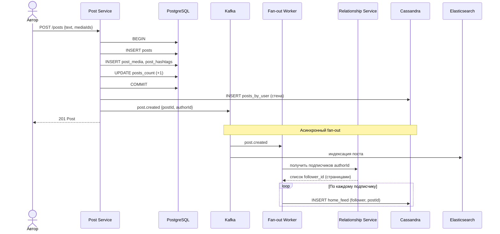
```mermaid
sequenceDiagram
    actor U as Автор
    participant PoS as Post Service
    participant PG as PostgreSQL
    participant K as Kafka
    participant FW as Fan-out Worker
    participant RS as Relationship Service
    participant C as Cassandra
    participant ES as Elasticsearch

    U->>PoS: POST /posts {text, mediaIds}
    PoS->>PG: BEGIN
    PoS->>PG: INSERT posts
    PoS->>PG: INSERT post_media, post_hashtags
    PoS->>PG: UPDATE posts_count (+1)
    PoS->>PG: COMMIT
    PoS->>C: INSERT posts_by_user (стена)
    PoS->>K: post.created {postId, authorId}
    PoS-->>U: 201 Post

    Note over K,C: Асинхронный fan-out
    K->>FW: post.created
    K->>ES: индексация поста
    FW->>RS: получить подписчиков authorId
    RS-->>FW: список follower_id (страницами)
    loop По каждому подписчику
        FW->>C: INSERT home_feed (follower, postId)
    end
```

## 5.6. Решение push vs pull (проблема звезды)

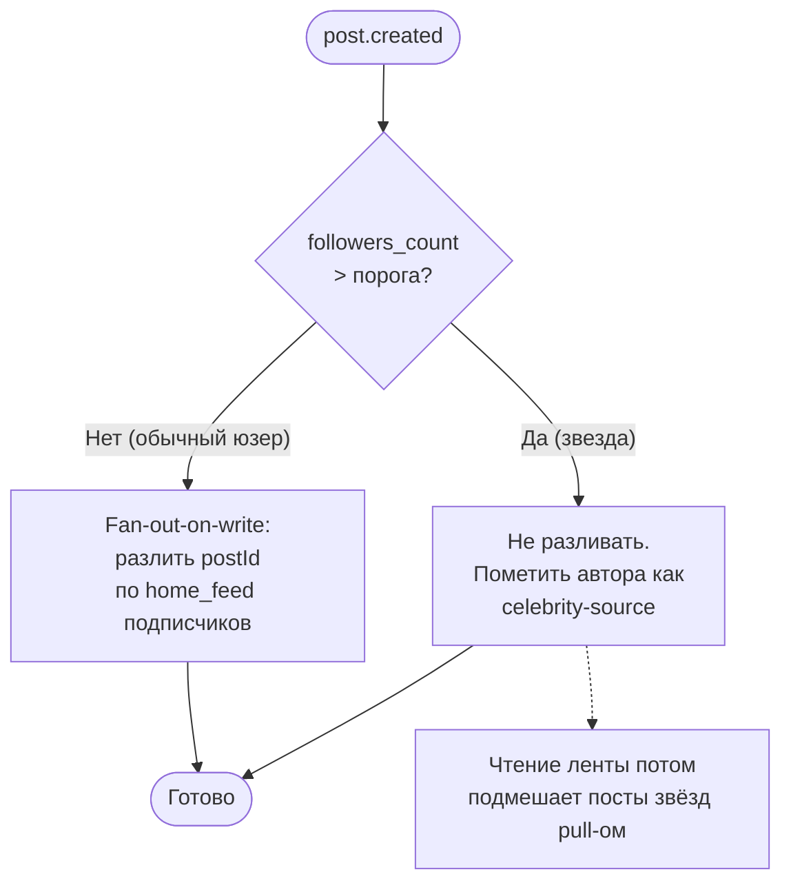
```mermaid
flowchart TD
    start([post.created]) --> q{followers_count<br/>> порога?}
    q -- "Нет (обычный юзер)" --> push[Fan-out-on-write:<br/>разлить postId<br/>по home_feed подписчиков]
    q -- "Да (звезда)" --> pull[Не разливать.<br/>Пометить автора как<br/>celebrity-source]
    push --> done([Готово])
    pull --> done
    note1["Чтение ленты потом<br/>подмешает посты звёзд pull-ом"]
    pull -.-> note1
```

## 5.7. Просмотр домашней ленты (merge push + pull)

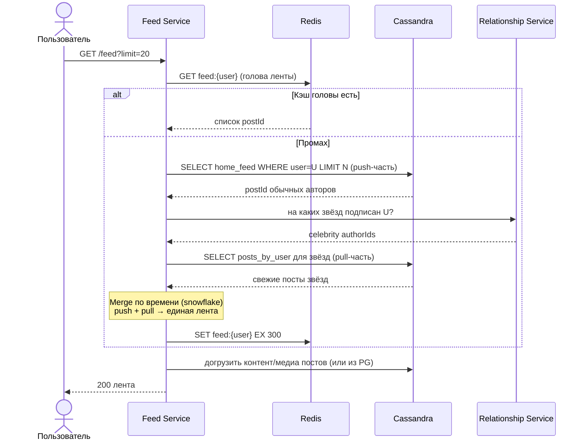
```mermaid
sequenceDiagram
    actor U as Пользователь
    participant FS as Feed Service
    participant R as Redis
    participant C as Cassandra
    participant RS as Relationship Service

    U->>FS: GET /feed?limit=20
    FS->>R: GET feed:{user} (голова ленты)
    alt Кэш головы есть
        R-->>FS: список postId
    else Промах
        FS->>C: SELECT home_feed WHERE user=U LIMIT N (push-часть)
        C-->>FS: postId обычных авторов
        FS->>RS: на каких звёзд подписан U?
        RS-->>FS: celebrity authorIds
        FS->>C: SELECT posts_by_user для звёзд (pull-часть)
        C-->>FS: свежие посты звёзд
        Note over FS: Merge по времени (snowflake)<br/>push + pull → единая лента
        FS->>R: SET feed:{user} EX 300
    end
    FS->>C: догрузить контент/медиа постов (или из PG)
    FS-->>U: 200 лента
```

## 5.8. Просмотр стены пользователя

```mermaid
sequenceDiagram
    actor U as Зритель
    participant FS as Feed Service
    participant C as Cassandra
    participant PG as PostgreSQL
    participant R as Redis

    U->>FS: GET /users/{id}/posts?cursor&limit
    FS->>C: SELECT posts_by_user WHERE user=id<br/>AND post_id < cursor LIMIT n
    C-->>FS: список postId (DESC)
    loop По каждому посту
        FS->>R: GET post:{id}:counters
        FS->>PG: SELECT контент (если нет в кэше)
    end
    FS-->>U: 200 посты + счётчики + nextCursor
```

## 5.9. Лайк поста (счётчик write-through)

```mermaid
sequenceDiagram
    actor U as Пользователь
    participant CS as Counter Service
    participant C as Cassandra
    participant R as Redis
    participant K as Kafka

    U->>CS: POST /posts/{id}/like
    CS->>C: INSERT post_likes (postId, userId) [IF NOT EXISTS]
    alt Новый лайк
        C-->>CS: applied
        CS->>C: INSERT likes_by_user (userId, postId)
        CS->>R: INCR post:{id}:likes
        CS->>K: like.added {postId, userId}
        CS-->>U: 200 {liked:true}
    else Уже лайкнуто (идемпотентно)
        C-->>CS: not applied
        CS-->>U: 200 {liked:true}
    end
```

## 5.10. Просмотр поста (уникальные просмотры через HLL)

```mermaid
sequenceDiagram
    actor U as Пользователь
    participant FS as Feed Service
    participant R as Redis

    U->>FS: пост попал в видимую область
    FS->>R: PFADD post:{id}:views {userId}
    Note over R: HyperLogLog — уникальные,<br/>~12КБ на пост, погрешность ~1%
    FS-->>U: (ничего, fire-and-forget)
    Note over FS,R: Точное число не нужно в реальном времени
```

## 5.11. Async-flush счётчиков (фон)

```mermaid
sequenceDiagram
    participant CW as Counter Flush Worker
    participant R as Redis
    participant C as Cassandra
    participant PG as PostgreSQL

    loop Каждые N секунд
        CW->>R: собрать «грязные» счётчики (dirty set)
        R-->>CW: post:{id}:likes, :views (PFCOUNT)
        CW->>C: UPDATE post_counters SET likes/views/comments
        CW->>PG: UPSERT post_counters (durable-зеркало)
        CW->>R: пометить как сброшенные
    end
    Note over CW: Тысячи INCR схлопываются<br/>в одну запись в БД
```

## 5.12. Отправка сообщения (с идемпотентностью)

```mermaid
sequenceDiagram
    actor A as Отправитель
    participant MS as Messaging Service
    participant R as Redis
    participant C as Cassandra
    participant N as Notifier
    participant P as Push

    A->>MS: POST /conversations/{c}/messages {text, clientMessageId}
    MS->>R: SET idem:{clientMessageId} NX
    alt Дубликат (ключ уже есть)
        R-->>MS: not set
        MS-->>A: 201 (вернуть ранее созданное сообщение)
    else Новое
        R-->>MS: ok
        MS->>C: INSERT messages_by_conversation (bucket=yyyyMM)
        MS->>C: UPDATE conversations_by_user участников<br/>(last_activity, превью) — delete+insert
        MS->>R: HINCRBY unread:{recipient} {c} 1
        MS->>N: уведомить получателя
        N->>R: GET presence:{recipient}
        alt Офлайн
            N->>P: push-уведомление
        else Онлайн
            N--)A: доставка по WebSocket получателю
        end
        MS-->>A: 201 Message
    end
```

## 5.13. Чтение сообщений и отметка «прочитано»

```mermaid
sequenceDiagram
    actor B as Получатель
    participant MS as Messaging Service
    participant C as Cassandra
    participant R as Redis

    B->>MS: GET /conversations/{c}/messages?cursor&limit
    MS->>C: SELECT messages_by_conversation<br/>WHERE (c, bucket) AND message_id < cursor LIMIT n
    C-->>MS: сообщения (DESC)
    MS-->>B: 200 сообщения + nextCursor

    B->>MS: POST /conversations/{c}/read {upToMessageId}
    MS->>C: UPDATE conversation_read_state<br/>SET last_read_message_id=upTo
    MS->>R: HDEL unread:{B} {c}
    MS->>R: пересчитать unread_total:{B}
    MS-->>B: 200 {unreadCount:0}
    Note over MS,C: «Прочитано» у отправителя =<br/>last_read >= message_id
```

## 5.14. Список диалогов (inbox)

```mermaid
sequenceDiagram
    actor U as Пользователь
    participant MS as Messaging Service
    participant C as Cassandra
    participant R as Redis

    U->>MS: GET /conversations?limit
    MS->>C: SELECT conversations_by_user<br/>WHERE user=U ORDER BY last_activity DESC
    C-->>MS: диалоги с превью последнего сообщения
    MS->>R: HGETALL unread:{U}
    R-->>MS: точные счётчики непрочитанного
    Note over MS: Сливаем превью (Cassandra)<br/>+ unread (Redis)
    MS-->>U: 200 список диалогов
```

---

# 6. Сквозные механизмы

## 6.1. Cache-aside — общий поток

```mermaid
flowchart TD
    start([Запрос на чтение]) --> get[GET ключ из Redis]
    get --> hit{Hit?}
    hit -- Да --> ret[Вернуть из кэша]
    hit -- Нет --> db[(Читать из БД)]
    db --> found{Найдено?}
    found -- Да --> setc[SET ключ EX ttl] --> ret
    found -- Нет --> neg[SET ключ:miss EX 60s<br/>negative cache] --> ret404[Вернуть 404]
    ret --> done([Ответ])
    ret404 --> done

    upd([Запись/обновление]) --> inval[DEL ключ<br/>инвалидация] --> done2([Готово])
```

## 6.2. Защита от thundering herd (single-flight)

```mermaid
sequenceDiagram
    participant R1 as Запрос 1
    participant R2 as Запрос 2..N
    participant Redis
    participant DB

    par Одновременный промах
        R1->>Redis: GET hot_key (miss)
        R2->>Redis: GET hot_key (miss)
    end
    R1->>Redis: SET lock:hot_key NX PX 300
    Redis-->>R1: получил лок
    R2->>Redis: SET lock:hot_key NX PX 300
    Redis-->>R2: НЕ получил (занято)
    R1->>DB: пересчитать значение
    DB-->>R1: данные
    R1->>Redis: SET hot_key, DEL lock
    R2->>Redis: GET hot_key (теперь hit) / или stale-значение
    Note over R2: Только один запрос<br/>ударил в БД
```

## 6.3. Идемпотентная запись

```mermaid
flowchart TD
    req([POST с client_message_id]) --> setnx["SET idem:{id} NX EX 24h"]
    setnx --> ok{Ключ установлен?}
    ok -- "Да (новый)" --> proc[Выполнить операцию] --> store[Сохранить результат<br/>под idem-ключом] --> resp[201 Created]
    ok -- "Нет (повтор)" --> fetch[Вернуть сохранённый результат] --> resp2[200/201 тот же ответ]
    resp --> done([Ответ])
    resp2 --> done
```

## 6.4. Kafka — конвейер обработки события поста

```mermaid
flowchart LR
    post[Post Service] -->|post.created| topic{{Topic: post.created}}
    topic --> g1[Consumer Group:<br/>Fan-out Worker]
    topic --> g2[Consumer Group:<br/>Search Indexer]
    topic --> g3[Consumer Group:<br/>Counter Init]

    g1 --> cass[(home_feed<br/>подписчиков)]
    g2 --> es[(Elasticsearch)]
    g3 --> redis[(счётчики = 0)]

    note["Одно событие → много<br/>независимых потребителей<br/>(fan-out на уровне шины)"]
    topic -.-> note
```

---

## Как рендерить

- **VS Code:** расширение «Markdown Preview Mermaid Support».
- **GitHub/GitLab:** Mermaid рендерится в `.md` нативно.
- **CLI в картинки:** `npx @mermaid-js/mermaid-cli -i docs/architecture.md -o out.md`
  (или экспорт каждого блока в SVG/PNG).
- **Онлайн:** вставить блок в <https://mermaid.live>.
